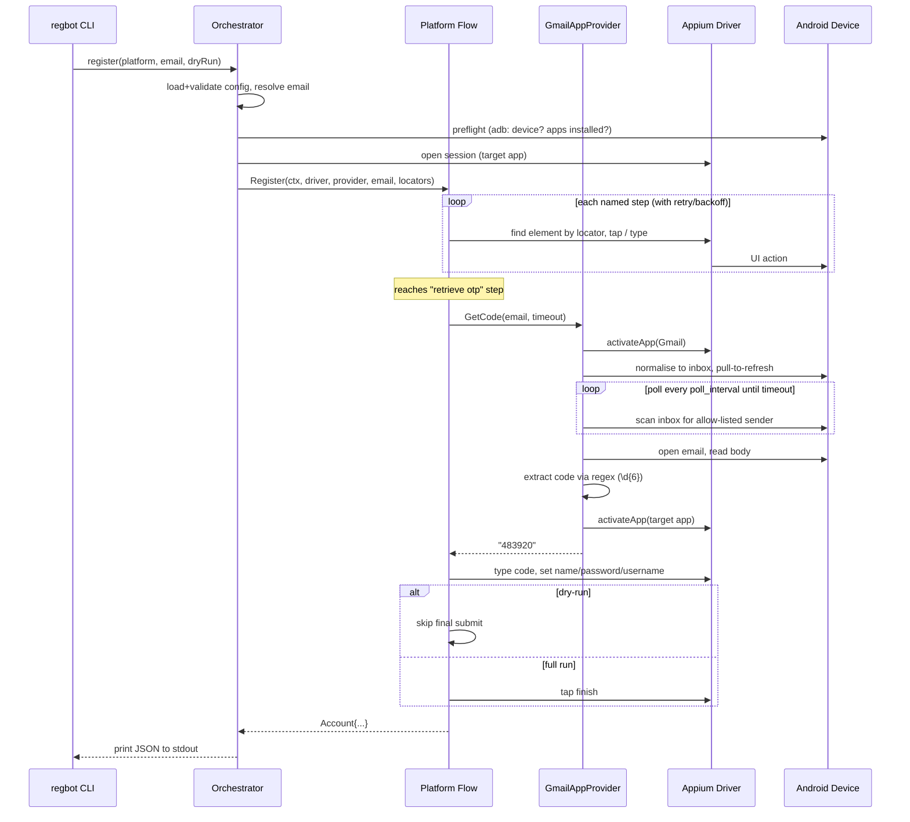

# RegBot

RegBot is a Go CLI that automates **email-based registration** for Instagram and
TikTok on an Android device. It drives the target app with **Appium**
(UiAutomator2) and reads the verification code directly from the on-device
**Gmail app** — no phone number, SMS gateway, or external email API required.

> ⚠️ **Educational use only.** Automated account creation violates the Terms of
> Service of Instagram and TikTok. This project exists to study mobile UI
> automation, cross-app orchestration, and clean Go architecture. Use test-only
> accounts you are authorised to automate. See the
> [Legal & Ethical Notice](#legal--ethical-notice).

**In one sentence:** open one Appium session, drive the sign-up screens, switch
to Gmail to grab the code, switch back, finish, and print the new account as JSON.

**Contents:** [Prerequisites](#1--prerequisites) · [Build](#2--build) ·
[Configure](#3--configure) · [Run](#4--run) · [How it works](#5--how-it-works) ·
[Real-device caveats](#6--before-it-works-on-a-real-device) ·
[Troubleshooting](#7--troubleshooting) · [Testing](#8--testing-without-a-device)

---

## 1 — Prerequisites

You need five things in place before RegBot can do anything useful.

| # | Requirement | Check |
|---|-------------|-------|
| 1 | **Go 1.22+** (to build) | `go version` |
| 2 | **Android device or emulator** (Android 10+) connected over ADB | `adb devices` |
| 3 | **`adb`** on your `PATH` | `adb version` |
| 4 | **Appium server** + **UiAutomator2** driver, running | `curl http://127.0.0.1:4723/status` |
| 5 | **Target app** (Instagram/TikTok) **and Gmail** installed, Gmail signed in | see below |

### Go

```bash
go version   # want go1.22 or newer
```

### A device Appium can reach

Either plug in a physical phone with **USB debugging** enabled, or start an
emulator. Confirm exactly one authorised device shows up:

```bash
adb devices
# List of devices attached
# emulator-5554   device
```

- `unauthorized` → accept the USB-debugging prompt on the phone.
- Nothing listed → cable/driver problem, or the emulator isn't booted.
- More than one line → set `device.udid` (or `device.device_name`) in config so
  RegBot pins the right one.

### Appium + UiAutomator2

Install once, then run the server:

```bash
npm install -g appium
appium driver install uiautomator2
appium              # starts on http://127.0.0.1:4723 by default
```

Leave that terminal running. Verify it answers:

```bash
curl -s http://127.0.0.1:4723/status
# {"value":{"ready":true, ... }}
```

### Apps installed + Gmail signed in

On the device:

- Install **Instagram** and/or **TikTok** (the app you'll register on).
- Install **Gmail** and **sign in** to the mailbox that will receive the
  verification code. This is the mailbox RegBot reads the OTP from — there is no
  external email API, so the code has to land in *this* Gmail app.

If you use `+alias` addressing (below), the alias still delivers to the same
Gmail inbox — Gmail treats `you+reg123@gmail.com` as `you@gmail.com`.

---

## 2 — Build

```bash
go build -o regbot ./cmd/regbot
# or: make build
```

You now have a `./regbot` binary.

---

## 3 — Configure

Copy the sample config and edit your own copy (the `*.local.yaml` name is
gitignored, so real addresses never get committed):

```bash
cp config.yaml config.local.yaml
```

The sections you'll most likely touch:

```yaml
appium:
  server_url: "http://127.0.0.1:4723"   # where your Appium server listens

device:
  device_name: "emulator-5554"          # from `adb devices`
  udid: ""                              # set this if you have >1 device

email:
  # Provide EXACTLY ONE of these two:
  address: "youraccount@gmail.com"      # a fixed address, OR
  base_address: ""                      # base for +alias generation
  alias_tag_prefix: "reg"               # -> youraccount+reg<rand>@gmail.com

otp:
  sender_allowlist: ["instagram", "tiktok", "no-reply"]  # who the code email is from
  code_regex: "\\d{6}"                  # how to extract the code
  wait_timeout: 60s                     # how long to wait for the email
  poll_interval: 5s                     # how often to re-check Gmail

timeouts:
  element_wait: 15s                     # per-element find timeout
  step_retry: 2                         # retries per step (attempts = retry + 1)
  step_backoff: 1s                      # delay between attempts
```

**Email: pick one mode.**

- `address` — RegBot registers with exactly that address.
- `base_address` + `alias_tag_prefix` — RegBot invents a fresh
  `base+reg<rand>@gmail.com` alias each run, all delivered to the same inbox.

Setting both (or neither) is a config error and exits with code `1`.

### Full configuration reference

The annotated schema lives in [`config.yaml`](./config.yaml). Every section:

| Section | Keys |
|---------|------|
| `appium` | `server_url`, `new_command_timeout` |
| `device` | `platform_name`, `device_name`, `automation_name`, `udid` (optional) |
| `apps` | `instagram_package`, `instagram_activity`, `tiktok_package`, `gmail_package` |
| `email` | `address` **or** `base_address` + `alias_tag_prefix` (exactly one mode) |
| `otp` | `sender_allowlist`, `code_regex` (default `\d{6}`), `wait_timeout`, `poll_interval` |
| `account` | `password_length`, `username_prefix` |
| `timeouts` | `element_wait`, `step_retry`, `step_backoff` |
| `paths` | `locators_dir`, `artifacts_dir` |
| `logging` | `level`, `file` |

### Environment overrides

Any value can be overridden with the `REGBOT_` prefix and underscores for
nesting:

```bash
export REGBOT_APPIUM_SERVER_URL="http://127.0.0.1:4723"
export REGBOT_EMAIL_ADDRESS="youraccount@gmail.com"
```

---

## 4 — Run

### Sanity-check first

Confirm the locator files load and every required element name is present:

```bash
./regbot locators verify
# instagram.json ... OK (13 TODO)
# tiktok.json    ... OK (12 TODO)
# gmail.json     ... OK (6 TODO)
```

> The `TODO` counts are expected: the shipped selectors are **placeholders**.
> See [§6](#6--before-it-works-on-a-real-device).

### Dry run (recommended first)

`--dry-run` does everything — connects, drives the screens, fetches the real
OTP — **except** the final submit. Great for validating your setup without
actually creating an account:

```bash
./regbot register instagram \
  --email youraccount@gmail.com \
  --config config.local.yaml \
  --dry-run
```

### Full run

Drop `--dry-run` to complete registration:

```bash
# Instagram, explicit email
./regbot register instagram --email youraccount@gmail.com --config config.local.yaml

# TikTok, generate a +alias from base_address in config
./regbot register tiktok --config config.local.yaml
```

### Flags

| Flag | Description | Default |
|------|-------------|---------|
| `--config` | Path to the YAML config file | `config.yaml` |
| `--email` | Target email (overrides config) | — |
| `--log-level` | `debug` \| `info` \| `warn` \| `error` | `info` |
| `--dry-run` | Validate + connect, but do not submit | `false` |

### What you get back

On success, the account prints to **stdout** as a single JSON object — and
**only** to stdout; it never appears in logs or artifacts:

```json
{
  "platform": "instagram",
  "email": "youraccount@gmail.com",
  "username": "user_8f3a21bd",
  "password": "‹generated›",
  "created_at": "2026-07-16T10:22:31Z",
  "status": "success"
}
```

Structured logs (progress, per-step timing, errors) go to **stderr** and the log
file (`logging.file`). To capture just the credentials:

```bash
./regbot register instagram --email you@gmail.com --config config.local.yaml \
  > account.json 2> run.log
```

### Exit codes

| Code | Meaning | Typical cause |
|------|---------|---------------|
| `0` | Success | Credentials printed |
| `1` | Config/validation error | Bad config, before any UI action |
| `2` | Automation failure | A step failed; artifacts written |
| `3` | OTP timeout | Code email didn't arrive / didn't match |
| `130` | Interrupted | Ctrl-C |

---

## 5 — How it works

### The one-session idea

RegBot opens **one** Appium session and reuses it for everything, including
reading the email. It never opens a second session for Gmail — it just switches
the foreground app with `mobile: activateApp` and switches back, so the
half-finished registration screen is preserved.

```text
┌────────────┐   drives     ┌───────────────┐   automates   ┌───────────────┐
│  regbot    │─────────────▶│ Appium server │──────────────▶│ Android device│
│  (Go CLI)  │  W3C HTTP    │ (UiAutomator2)│   UI actions  │  IG/TikTok    │
└────────────┘              └───────────────┘               │  + Gmail app  │
       ▲  reads OTP by switching to Gmail in the SAME session│               │
       └────────────────────────────────────────────────────▶└───────────────┘
```

### Step-by-step sequence



### The pieces

| Layer | Package | Responsibility |
|-------|---------|----------------|
| CLI | `cmd/regbot` | Parse flags, map errors → exit codes, print JSON. Thin adapter only. |
| Orchestration | `internal/core` | Load config, pre-flight (ADB), open the session, wire the flow + OTP provider, write artifacts. |
| Flows | `internal/flows` | The named-step sequences for Instagram/TikTok, plus the step runner (retry/backoff/artifacts) and credential generation. |
| OTP | `internal/otp` + `.../gmailapp` | `OTPProvider` interface and the Gmail-app implementation that reads the code. |
| Appium | `internal/appium` | Hand-rolled W3C WebDriver HTTP client (no third-party Appium library). |
| Config | `internal/config` | viper-based loading, validation, and the zap logger. |
| Locators | `internal/locators` | Load/validate the JSON selector files; resolve an element from an ordered candidate list. |
| ADB | `internal/adb` | Minimal pre-flight: is a device connected/authorised, is the app installed. |

### A "flow" is a list of named steps

Each platform flow is just an ordered list of steps (see
`internal/flows/instagram.go`). For Instagram, roughly:

1. launch create-account → 2. enter email → 3. tap next →
4. wait for confirm-email screen → 5. **retrieve OTP** (switches to Gmail) →
6. enter OTP → 7. submit OTP → 8. set full name → 9. set password →
10. set username (regenerates if taken) → 11. set birthday →
12. dismiss optional screens → 13. **finalise** (skipped on `--dry-run`).

A shared runner executes them in order. On each step it applies
`step_retry`/`step_backoff`, logs the step, and — **on failure** — captures a
screenshot + page source before returning. TikTok's flow is the same shape with
its own step list.

### How the OTP is read (the interesting part)

When the flow hits the "retrieve otp" step it calls
`provider.GetCode(ctx, email, timeout)`. The Gmail-app provider then:

1. Records the current foreground app, switches to Gmail (`activateApp`).
2. Normalises state: backs out of any open conversation to the inbox.
3. Pull-to-refresh (swipe down near the top).
4. Polls every `poll_interval` (up to `wait_timeout`) for a recent email whose
   sender matches `sender_allowlist`.
5. Opens the email, reads the body, extracts the code with `code_regex`
   (default `\d{6}`).
6. Switches **back** to the target app so registration continues where it left
   off.
7. Returns the code — or, on timeout, an error (exit code `3`) with a screenshot.

Because it only ever *switches apps*, the registration screen underneath is
untouched.

### Where selectors come from

RegBot never hard-codes UI selectors. They live in versioned JSON under
[`locators/`](./locators) — one file per app. Each logical element (e.g.
`email_field`) maps to an **ordered list of candidate selectors**; the first one
that matches wins, so you can add fallbacks for different app versions without
changing Go code.

```json
"email_field": [
  { "by": "id", "selector": "com.instagram.android:id/email" },
  { "by": "-android uiautomator", "selector": "new UiSelector().className(\"android.widget.EditText\")" }
]
```

Supported strategies: `id`, `accessibility id`, `xpath`, `-android uiautomator`,
`class name`.

### Artifacts on failure

If a step fails, RegBot writes to `paths.artifacts_dir`:

- `‹run-id›-‹step›.png` — screenshot at the moment of failure,
- `‹run-id›-‹step›.xml` — the page source (UI tree),
- `‹run-id›-result.json` — a run summary and the error (**never** the password).

These are your first stop when a run exits with code `2`: open the PNG to see
what screen it was actually on, and the XML to find the real selector.

---

## 6 — Before it works on a real device

Two things are intentionally left as placeholders, because they depend on the
exact app version and device you run against:

1. **Selectors are guesses.** Every entry in `locators/*.json` is a best-guess
   placeholder marked `todo`, which is why `locators verify` reports non-zero
   TODO counts. You must verify each one against your installed app version:
   - Run a dry run; when a step fails, open the `-‹step›.xml` artifact.
   - Find the real resource-id / text / class for that element.
   - Update the candidate list in `locators/‹app›.json` and re-run.
   - `appium inspector` (the GUI) is the fastest way to explore the UI tree.

2. **Date-picker steps are stubs.** The Instagram/TikTok birthday steps generate
   a valid adult date but currently just advance the screen rather than driving
   the device-specific date picker (marked `TODO` in the flow). If your target
   app requires a real birthday selection, implement the picker interaction for
   your device.

---

## 7 — Troubleshooting

| Symptom | Likely cause / fix |
|---------|--------------------|
| `preflight: adb: no device connected` | Nothing attached, or `adb` not on PATH. Run `adb devices`. |
| `preflight: adb: device unauthorised` | Accept the USB-debugging prompt on the device. |
| `preflight: required app "…" is not installed` | Install the target app / Gmail. |
| `open appium session: …` | Appium not running or wrong `server_url`. `curl .../status`. |
| `resolve "…": no candidate matched` | Locators drifted. Open the failure `.xml`, fix `locators/‹app›.json`, re-run `locators verify`. |
| Exit `3` / `verification code not found` | Email didn't arrive in time, or `sender_allowlist`/`code_regex` mismatch. Raise `otp.wait_timeout`; confirm Gmail is signed into the right inbox. |
| Exit `1` | Config invalid — the error names the offending field (e.g. both `email.address` and `email.base_address` set). |
| Registration screen lost after OTP | Ensure `apps.*_package` is correct so `activateApp` returns to the right app. |

---

## 8 — Testing without a device

You don't need hardware to exercise almost all of RegBot — the tests simulate
Appium and Gmail with an in-process HTTP server:

```bash
go test ./...                    # unit tests, no device
go test -tags=integration ./...  # on-device smoke test (real Appium + device)
golangci-lint run                # lint
make test | make lint            # via Makefile
```

The `integration`-tagged test (`internal/core/integration_test.go`) performs a
real `--dry-run` Instagram registration and is the on-hardware equivalent of the
dry run in [§4](#4--run). It requires a running Appium server, a connected device
with the apps installed, and Gmail signed in. Point it at your config with
`REGBOT_CONFIG=/path/to/config.local.yaml`.

---

## Legal & Ethical Notice

Automated account creation violates the Terms of Service of Instagram and TikTok,
and may violate local laws or platform anti-fraud provisions. RegBot is provided
strictly for **educational study** of mobile UI automation and software
architecture. Do not use it to create accounts on services you are not authorised
to automate, to evade bans, to impersonate, or to conduct spam or fraud. Use
test-only accounts and comply with all applicable terms and laws. You are solely
responsible for how you use this software.
